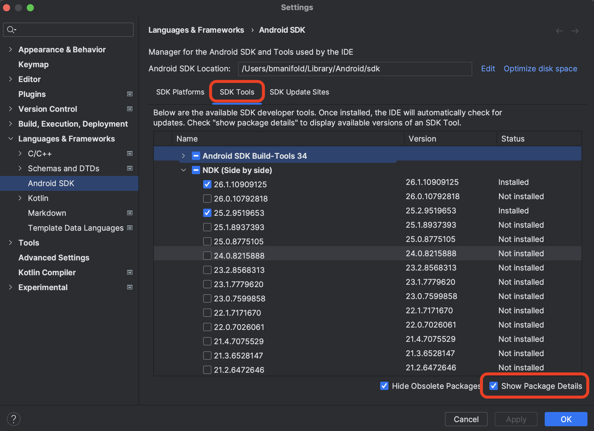

# Firezone Android client

This README contains instructions for building and testing the Android client
locally.

## Dev Setup

1. [Install Rust](https://www.rust-lang.org/tools/install)

1. [Install Android Studio](https://developer.android.com/studio)

1. Install your JDK 17 of choice. We recommend just
   [updating your CLI](https://stackoverflow.com/questions/43211282/using-jdk-that-is-bundled-inside-android-studio-as-java-home-on-mac)
   environment to use the JDK bundled in Android Studio to ensure you're using
   the same JDK on the CLI as Android Studio.

1. Install the Android SDK through Android Studio.
   * Open Android studio, go to Android Studio > Preferences
   * Search for `sdk`
   * Find the `Android SDK` nav item under `System Settings` and select
   * Click the `Edit` button next to the `Android SDK Location` field
   * Follow the steps presented to install Android SDK

1. Install `NDK` using Android Studio

   To see which version is installed, make sure to select the `Show Package Details` checkbox in the `Android SDK` settings page in Android Studio

   

   Make sure the correct NDK version is installed by looking at: `../../rust/connlib/clients/android/connlib/build.gradle.kts`

1. Set the following ENV variables in the start up config for your shell:
   ```
   JAVA_HOME=/Applications/Android\ Studio.app/Contents/jbr/Contents/Home
   ANDROID_HOME=/Users/<username>/Library/Android/sdk
   NDK_HOME=$ANDROID_HOME/ndk-bundle
   PATH=$PATH:$ANDROID_HOME/platform-tools:$ANDROID_HOME/tools:$ANDROID_HOME/tools/bin
   ```
1. Make sure the following Rust targets are installed:
   ```
   aarch64-linux-android
   arm-linux-androideabi
   armv7-linux-androideabi
   i686-linux-android
   x86_64-linux-android
   ```

   If using `rustup` you can run:
   ```
   rustup target add aarch64-linux-android arm-linux-androideabi armv7-linux-androideabi i686-linux-android x86_64-linux-android
   ```

1. Perform a test build: `./gradlew assembleDebug`

1. Add your debug signing key's SHA256 fingerprint to the portal's
   [`assetlinks.json`](../../elixir/apps/web/priv/static/.well-known/assetlinks.json)
   file. This is required for the App Links to successfully intercept the Auth
   redirect.
   ```
   ./gradlew signingReport
   ```

# Release Setup

We release from GitHub CI, so this shouldn't be necessary. But if you're looking
to test the `release` variant locally:

1. Download the keystore from 1Pass and save to `app/.signing/keystore.jks` dir.
1. Download firebase credentials from 1Pass and save to
   `app/.signing/firebase.json`
1. Now you can execute the `*Release` tasks with:

```shell
export KEYSTORE_PATH="$(pwd)/app/.signing/keystore.jks"
export FIREBASE_CREDENTIALS_PATH="$(pwd)/app/.signing/firebase.json"
HISTCONTROL=ignorespace # prevents saving the next line in shell history
 KEYSTORE_PASSWORD='keystore_password' KEYSTORE_KEY_PASSWORD='keystore_key_password' ./gradlew assembleRelease
```
